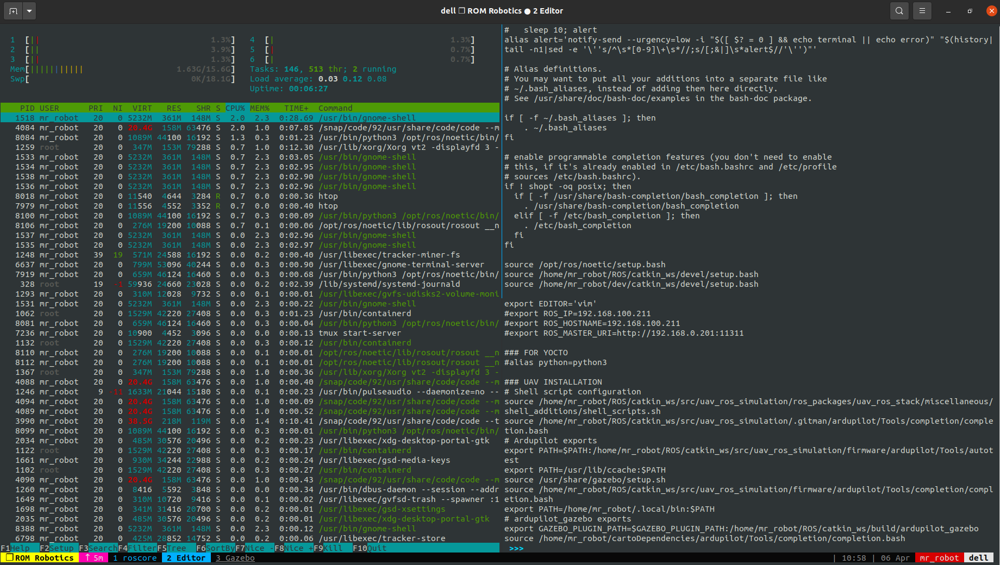

# tmux

<b>for first use, uncomment these lines </b>

<i>sudo apt install -y tmux tmuxinator neofetch

mv ~/.tmux.conf ~/.tmux.conf.backup

cp ./.tmux.conf ~/.tmux.conf

echo "Backup and copy ~/.tmux.conf "</i>

